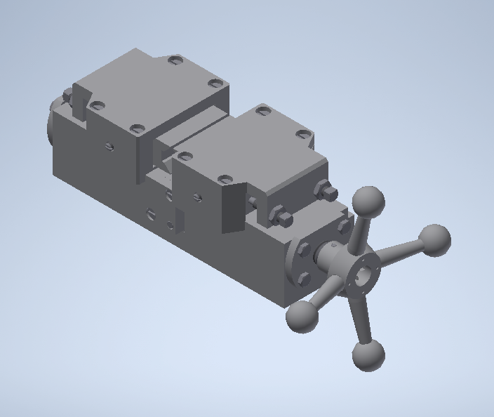

# Vise-00-000.06.05.05.00
The vice is designed for clamping shafts and other cylindrical parts with a diameter of up to 29 mm when milling key slots, foxes, etc.
Column 1 is installed on the square 10. The column is fastened to the square with bolts 14, 15. Two jaws are installed on the column 1. Bushings 4 and 12 are inserted into the jaws, through which the screw 3 with right and left threads passes. Each bushing is attached to the jaw with four bolts 13. A retainer 11 is attached to the column using diagonally located screws 16 and a pin 28, which prevents axial displacement of the screw 3. Prisms 5 are installed on the jaws 5. Cover 6 is attached to the jaw 2 with four screws 17.
The prism is adjusted in the longitudinal direction using screws 19, after which it is fixed with a screw 18. At the end of screw 3, a steering wheel is attached using a pin 22, consisting of a nut 7, four handles 8 with ball handles 9. Handles 8 are inserted into holes with a diagonal 10 of a nut 7 and are fixed by pins 21. When the handwheel is rotated clockwise, the bushings 4 and 12 move along the screw 3 in the opposite direction and pull the jaws on which the prisms are installed. The prisms come close and clamp the product. When rotated counterclockwise, the prisms expand and free the product.

Scope of work:
Assembly drawing, Specification
3D models of parts and Assembly (+ component spacing):
- 00-000.06.05.05.00 SAT Vise
- 00-000.06.05.05.01 Column
- 00-000.06.05.05.02 Sponge
- 00-000.06.05.05.03 Screw
- 00-000.06.05.05.04 Bushing
- 00-000.06.05.05.05 Prism
- 00-000.06.05.05.06 Cover
- 00-000.06.05.05.07 Nut
- 00-000.06.05.05.08 Handle
- 00-000.06.05.05.09 Handle
- 00-000.06.05.05.10 Square
- 00-000.06.05.05.11 Clamp
- 00-000.06.05.05.12 Bushing

Part Drawings:
- 00-000.06.05.05.01 Column
- 00-000.06.05.05.02 Sponge
- 00-000.06.05.05.03 Screw
- 00-000.06.05.05.04 Bushing
- 00-000.06.05.05.05 Prism
- 00-000.06.05.05.06 Cover
- 00-000.06.05.05.07 Nut
- 00-000.06.05.05.08 Handle
- 00-000.06.05.05.09 Handle
- 00-000.06.05.05.10 Square
- 00-000.06.05.05.11 Clamp
- 00-000.06.05.05.12 Bushing

